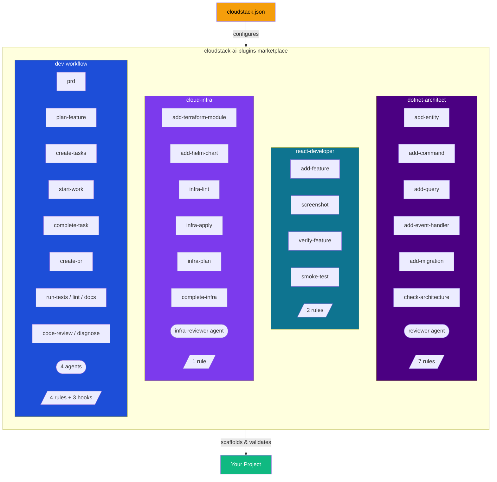
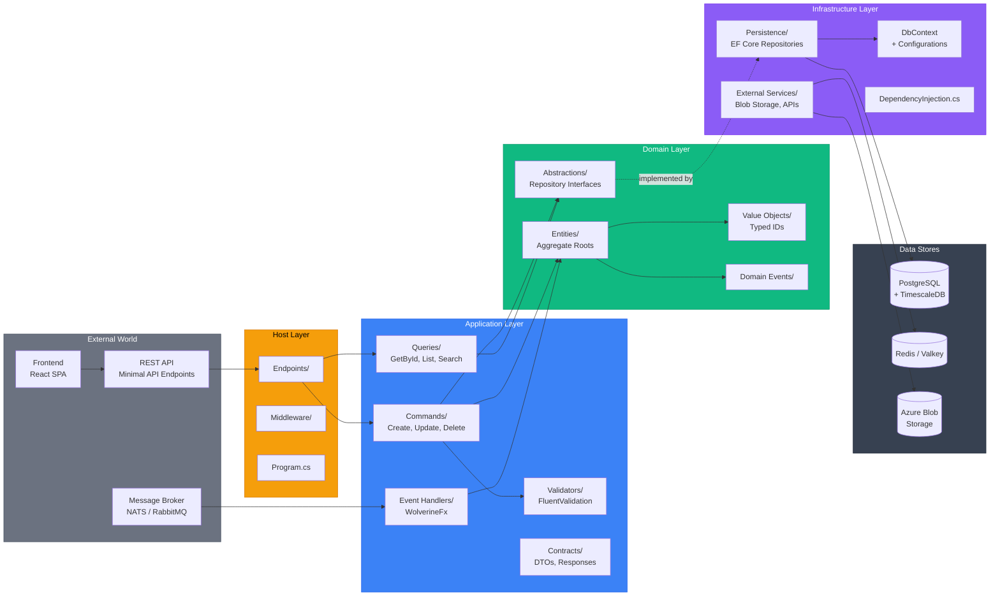
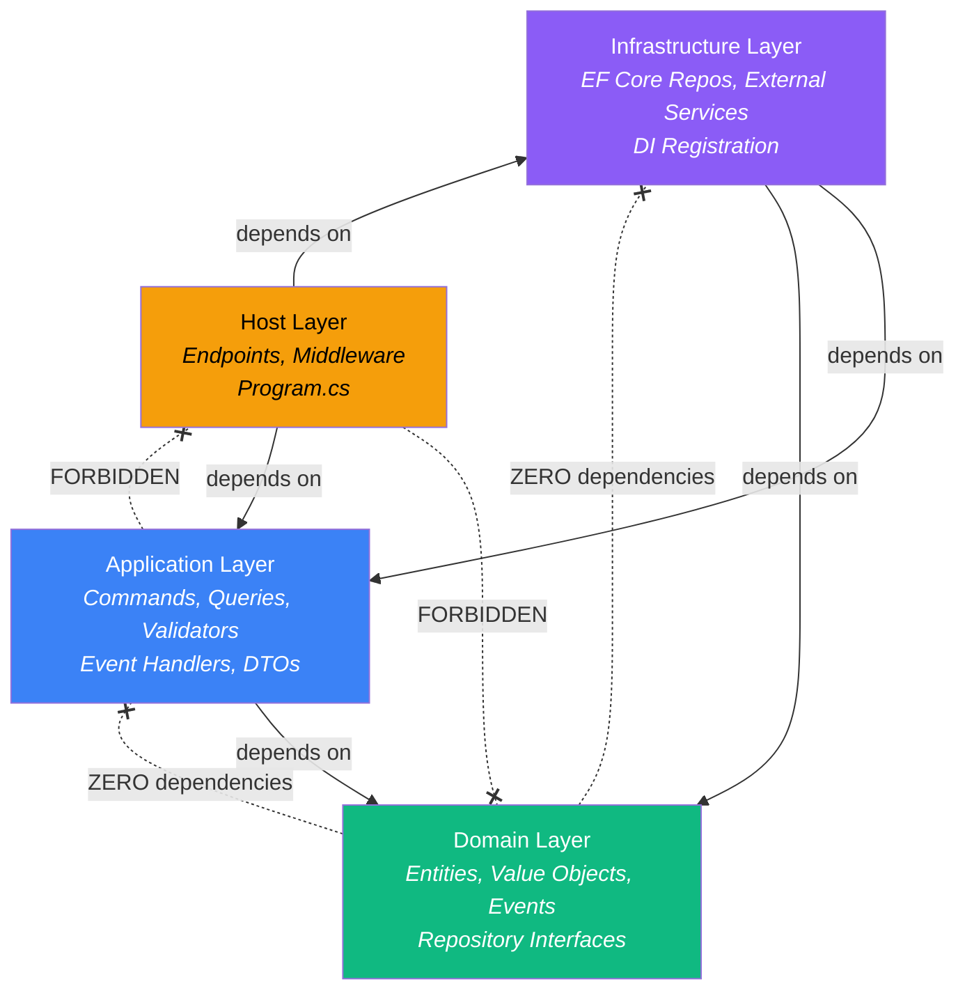
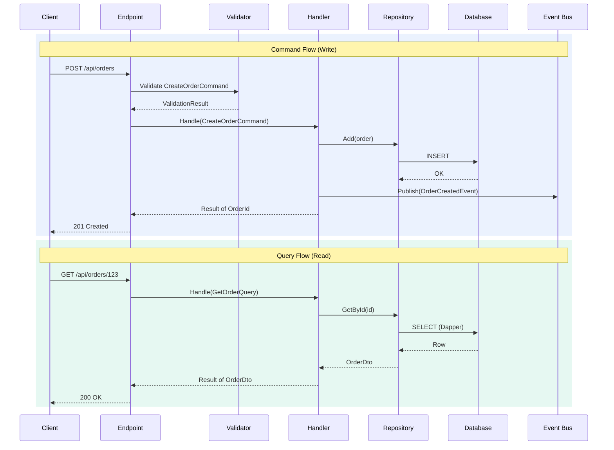
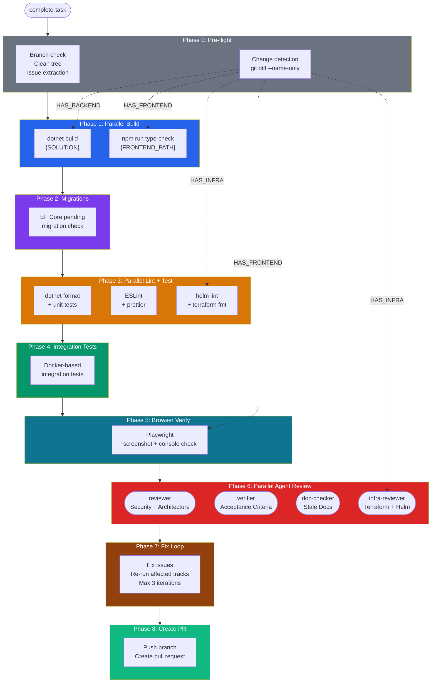
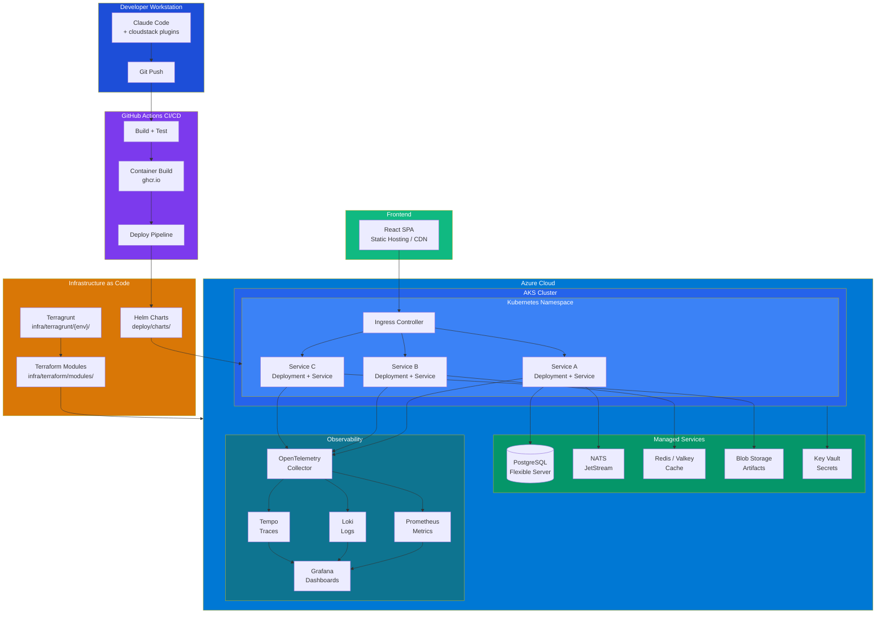

# cloudstack-ai-plugins

[](LICENSE)
[](plugins/)
[](plugins/)
[](plugins/)
[](https://dotnet.microsoft.com/)
[](https://react.dev/)
[](https://www.terraform.io/)

> AI-powered full-stack cloud engineer for Claude Code. 29 skills, 6 agents, 14 rules across 4 plugins.

```
/plugin marketplace add makigjuro/cloudstack-ai-plugins
```

Claude Code plugin marketplace for full-stack cloud engineering. Install any combination of plugins to get an AI-powered engineering toolkit for .NET + React + Azure projects.

## Plugin Marketplace



| Plugin | Skills | Agents | Rules | What It Does |
|--------|--------|--------|-------|-------------|
| [dotnet-architect](plugins/dotnet-architect/) | 6 | 1 | 7 | Hexagonal architecture scaffolding, CQRS, domain entities, migrations, code review |
| [react-developer](plugins/react-developer/) | 4 | 0 | 2 | React feature modules, Playwright screenshots, smoke testing |
| [cloud-infra](plugins/cloud-infra/) | 6 | 1 | 1 | Terraform modules, Helm charts, infra linting, infrastructure review |
| [dev-workflow](plugins/dev-workflow/) | 13 | 4 | 4 | PRD to PR workflow, quality gates, parallel code review, git conventions |

Install all four for the complete "cloud engineer" experience, or pick individual plugins for your stack.

## Quick Start

### 1. Add the marketplace

```
/plugin marketplace add makigjuro/cloudstack-ai-plugins
```

### 2. Install plugins

```
/plugin install dotnet-architect@cloudstack-ai-plugins
/plugin install react-developer@cloudstack-ai-plugins
/plugin install cloud-infra@cloudstack-ai-plugins
/plugin install dev-workflow@cloudstack-ai-plugins
```

### 3. Configure your project (optional)

Create a `cloudstack.json` at your project root to customize paths, namespaces, and conventions. Without it, plugins auto-detect from your project structure.

```json
{
  "$schema": "https://raw.githubusercontent.com/makigjuro/cloudstack-ai-plugins/main/schema/cloudstack.schema.json",
  "project": {
    "name": "MyProject",
    "namespace": "MyProject"
  },
  "backend": {
    "solutionPath": "src/MyProject.sln",
    "services": [
      { "name": "OrderService", "path": "src/OrderService", "projectPrefix": "MyProject.OrderService" }
    ]
  },
  "frontend": {
    "path": "web",
    "devPort": 5173
  },
  "infrastructure": {
    "chartsPath": "deploy/charts",
    "terraformPath": "infra/terraform/modules"
  }
}
```

See [cloudstack.json reference](docs/cloudstack-json-reference.md) for all available fields.

### 4. Use the skills

```
/dotnet-architect:add-entity Device OrderService
/dotnet-architect:add-command CreateOrder OrderService
/react-developer:add-feature orders
/cloud-infra:add-helm-chart order-service
/dev-workflow:complete-task
```

## Reference Architecture

These plugins encode a battle-tested architecture for cloud-native .NET microservices. Below is a visual guide to the patterns enforced and scaffolded by the plugins.

### Hexagonal Architecture (per microservice)

Each microservice follows hexagonal (ports & adapters) architecture with strict layer dependency rules. The `dotnet-architect` plugin scaffolds and enforces this structure.



**Layer dependency rules** (enforced by `check-architecture`):



- **Domain** has zero dependencies on any other layer
- **Application** depends only on Domain (never Host or Infrastructure)
- **Infrastructure** implements Domain interfaces (repository pattern)
- **Host** wires everything together via DI and exposes endpoints

### CQRS Flow

Commands (writes) and queries (reads) follow separate paths through the architecture. The `add-command` and `add-query` skills scaffold these patterns.



**Key patterns:**
- Commands go through validation before reaching the handler
- Handlers return `Result<T>` instead of throwing exceptions
- Domain events are published after successful state changes
- Queries use Dapper for fast, optimized reads (separate from EF Core writes)

### Development Workflow

The `dev-workflow` plugin orchestrates the full software development lifecycle. Every step has a corresponding skill.

```mermaid
graph LR
    subgraph plan["Plan"]
        prd["prd"]
        planf["plan-feature"]
    end

    subgraph track["Track"]
        tasks["create-tasks"]
        start["start-work"]
    end

    subgraph build["Build"]
        entity["add-entity"]
        cmd["add-command"]
        query["add-query"]
        feat["add-feature"]
        helm["add-helm-chart"]
        tf["add-terraform-module"]
    end

    subgraph verify["Verify"]
        arch["check-architecture"]
        tests["run-tests"]
        lint["lint"]
        screenshot["verify-feature"]
    end

    subgraph complete["Complete"]
        ct["complete-task"]
        review["code-review"]
        qa["task-check"]
        pr["create-pr"]
    end

    prd --> tasks
    planf --> tasks
    tasks --> start
    start --> build
    build --> verify
    verify --> ct
    ct --> review
    ct --> qa
    review --> pr
    qa --> pr

    style plan fill:#7C3AED,color:#fff
    style track fill:#2563EB,color:#fff
    style build fill:#059669,color:#fff
    style verify fill:#D97706,color:#fff
    style complete fill:#DC2626,color:#fff
```



### Complete-Task Pipeline

The `complete-task` skill runs a multi-phase pipeline with parallel execution and dynamic agent composition. Phases are gated by change detection — if you only changed frontend code, backend checks are skipped.



### Cloud Infrastructure

The `cloud-infra` plugin targets this production architecture. Terraform modules provision the cloud resources, Helm charts deploy the workloads.



## How It Works

### Convention over configuration

Plugins read `cloudstack.json` for project-specific values (namespaces, service names, paths). If the file doesn't exist, they auto-detect from your project structure:

- **Solution path**: Finds `*.sln` in `src/`
- **Services**: Discovers directories with `.Application/` subfolders
- **Frontend path**: Defaults to `web/`
- **Helm charts**: Defaults to `deploy/charts/`
- **Terraform modules**: Defaults to `infra/terraform/modules/`

### Plugin independence

Each plugin works standalone. `dev-workflow` adapts based on which other plugins are installed:

- **With dotnet-architect**: `complete-task` runs .NET build, lint, architecture checks
- **With react-developer**: `complete-task` runs frontend type-check, lint, browser verification
- **With cloud-infra**: `complete-task` runs Helm lint, Terraform validate
- **Without any**: `complete-task` still handles git workflow, PR creation, and code review

### MCP server compatibility

Skills are designed to work with or without MCP servers:

- **context7** (recommended): Library documentation lookup for EF Core, TanStack Query, etc.
- **playwright** (recommended for react-developer): Browser automation for screenshots and verification
- **github-mcp-server** (optional): Structured GitHub operations (falls back to `gh` CLI)

## Supported Stack

**Current (v0.1):**
- Backend: .NET 10, C# 14, hexagonal architecture, EF Core 10, WolverineFx
- Frontend: React 19, TypeScript, TanStack Query, Zustand, shadcn/ui
- Infrastructure: Terraform, Helm, Azure/AKS, GitHub Actions
- Local dev: .NET Aspire or Docker Compose

**Planned:**
- Additional frontend frameworks (Vue, Angular)
- Additional cloud providers (AWS, GCP)
- Additional backend frameworks (Go, Node.js)

## Repository Structure

```
cloudstack-ai-plugins/
├── .claude-plugin/marketplace.json    # Marketplace manifest
├── schema/cloudstack.schema.json      # JSON Schema for cloudstack.json
├── plugins/
│   ├── dotnet-architect/              # .NET hexagonal architecture
│   ├── react-developer/              # React frontend
│   ├── cloud-infra/                  # Terraform + Helm
│   └── dev-workflow/                 # Workflow orchestration
├── templates/
│   └── cloudstack.json               # Starter config
└── docs/
    ├── getting-started.md             # Installation guide
    ├── architecture.md                # Reference architecture deep-dive
    ├── cloudstack-json-reference.md   # Configuration reference
    └── plugin-development.md          # Contributing guide
```

## Documentation

- [Getting Started](docs/getting-started.md) -- Installation and first steps
- [Reference Architecture](docs/architecture.md) -- Deep-dive into the patterns and conventions
- [cloudstack.json Reference](docs/cloudstack-json-reference.md) -- All configuration fields
- [Plugin Development](docs/plugin-development.md) -- How to contribute

## Contributing

Contributions welcome! See [plugin development guide](docs/plugin-development.md).

## License

MIT
