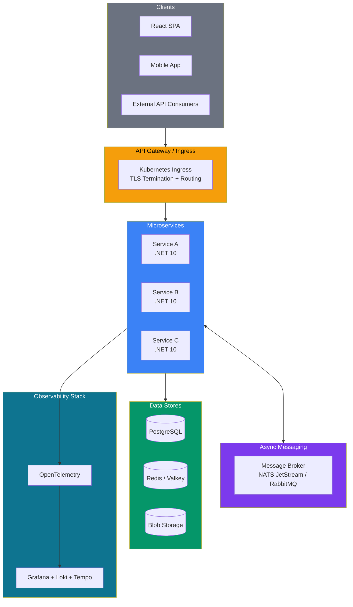
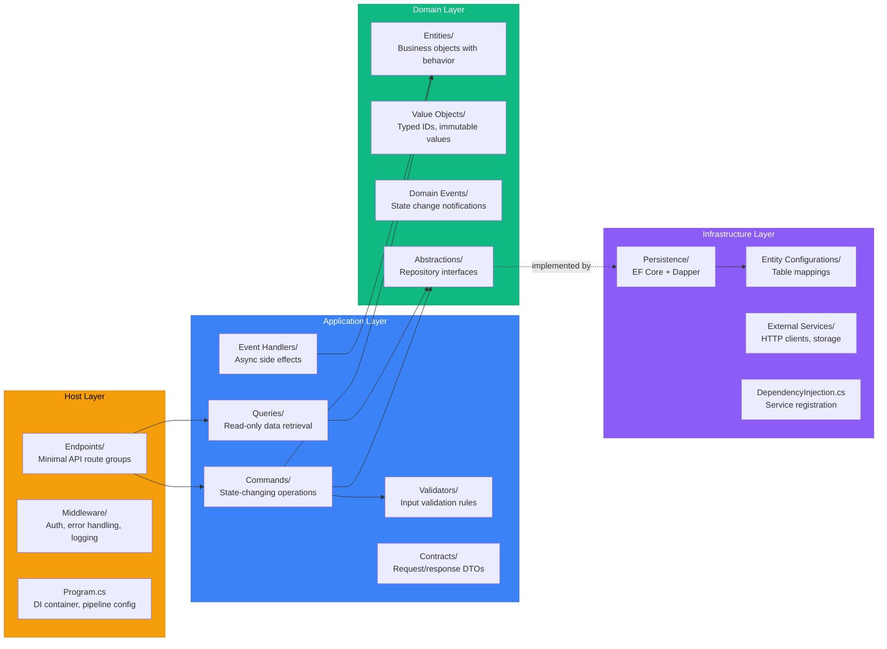
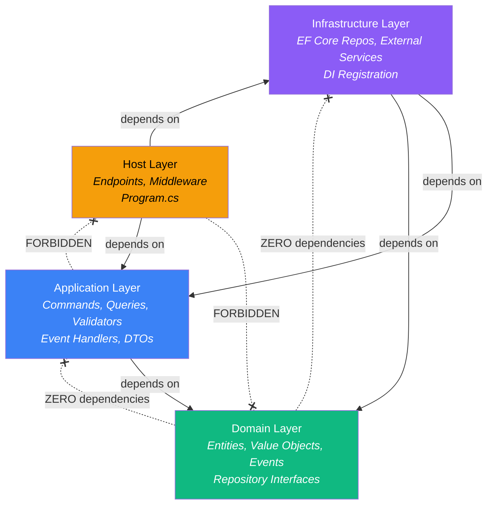
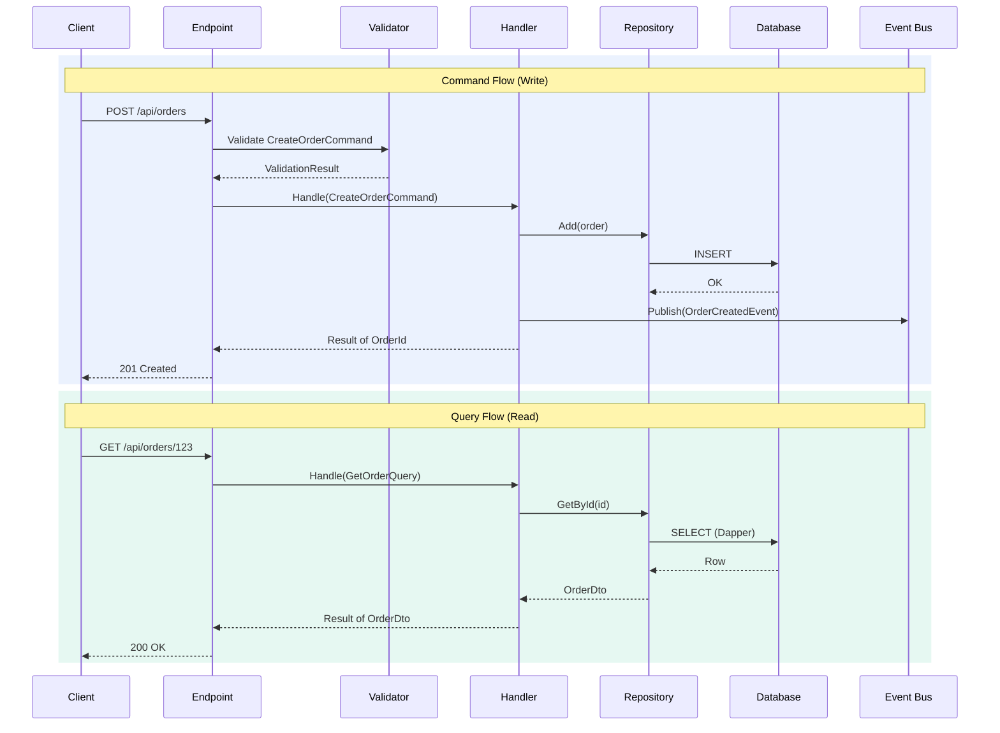
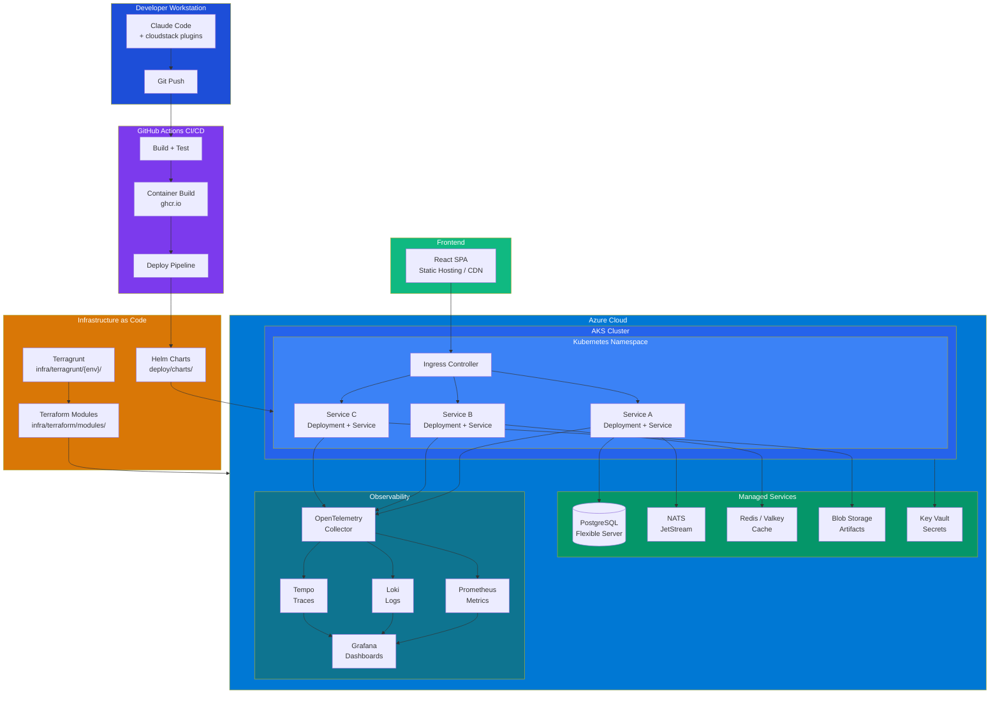
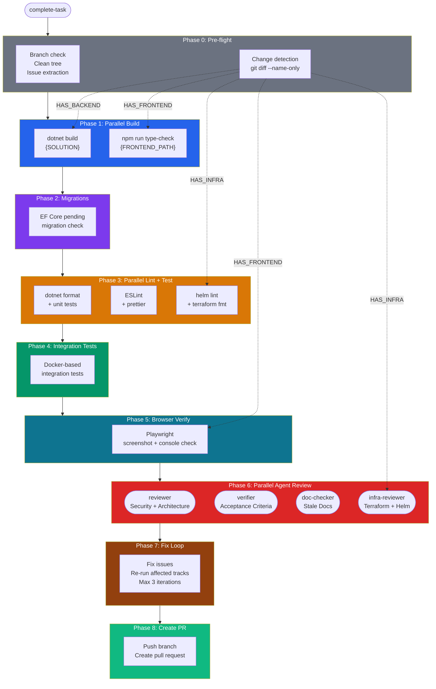

# Reference Architecture

This document describes the software and cloud architecture that the cloudstack-ai-plugins encode. Every skill, rule, and agent in this marketplace is built to scaffold, enforce, and review these patterns.

## Overview

The reference architecture is a cloud-native microservices platform built on .NET, React, and Azure. It uses hexagonal architecture for backend services, CQRS for command/query separation, and event-driven communication between services.



## Hexagonal Architecture

Every microservice follows hexagonal (ports & adapters) architecture. This pattern isolates business logic from infrastructure concerns, making services testable, maintainable, and adaptable.

### Project Structure

Each service consists of four projects:

```
ServiceName/
├── ServiceName.Domain/           # Pure business logic, zero dependencies
├── ServiceName.Application/      # Use cases (commands, queries, events)
├── ServiceName.Infrastructure/   # External integrations (DB, APIs, cache)
└── ServiceName.Host/             # HTTP endpoints, DI wiring, startup
```

Plus shared projects used by all services:

```
Shared/
├── {Namespace}.Domain/                    # Shared entities, value objects, events
└── {Namespace}.Shared.Infrastructure/     # Result types, auth, resilience
```

### Layer Responsibilities



### Layer Dependency Rules

These rules are enforced by the `check-architecture` skill and the `reviewer` agent:



| Rule | Why |
|------|-----|
| Domain has zero dependencies | Business logic never changes because of a database or framework switch |
| Application cannot reference Host | Use cases must be invokable from any entry point (HTTP, CLI, message handler) |
| Infrastructure implements Domain interfaces | Dependency inversion -- domain defines the contract, infra fulfills it |
| Host cannot reference Domain directly | All access goes through Application layer handlers |

## CQRS Pattern

Commands (writes) and queries (reads) follow separate paths. This enables independent optimization -- writes use EF Core with change tracking, reads use Dapper for raw performance.



### Key Design Decisions

**Result pattern over exceptions.** Handlers return `Result<T>` for business logic outcomes. Exceptions are reserved for truly exceptional situations (network failures, bugs). This makes error handling explicit and testable.

```csharp
// Command handler returns Result<T>
public async Task<Result<OrderId>> Handle(CreateOrderCommand command) {
    var customer = await _repo.GetById(command.CustomerId);
    if (customer is null)
        return Result<OrderId>.Failure(Errors.Customer.NotFound);

    var order = Order.Create(customer.Id, command.Items);
    await _repo.Add(order);
    return Result<OrderId>.Success(order.Id);
}
```

**Typed IDs.** Every entity uses a value object ID instead of raw `Guid`. This prevents accidentally passing an `OrderId` where a `CustomerId` is expected.

```csharp
public class OrderId : ValueObject {
    public Guid Value { get; init; }
    public static OrderId New() => new(Guid.NewGuid());
}
```

**Domain events.** State changes publish events that other handlers can react to asynchronously. This decouples services and enables event-driven workflows.

## Frontend Architecture

The React frontend follows a feature-based module structure. Each feature is self-contained with its own pages, components, and API integration.

```
web/src/
├── api/
│   ├── client.ts              # Axios singleton with auth interceptors
│   ├── types/                 # Shared API types
│   └── services/              # Per-domain API clients
│       ├── orders.api.ts
│       └── customers.api.ts
├── features/
│   ├── orders/
│   │   ├── pages/             # Route-level components
│   │   └── components/        # Feature-specific components
│   └── customers/
│       ├── pages/
│       └── components/
├── hooks/api/                 # TanStack Query hooks
├── stores/                    # Zustand client state
└── routes/                    # React Router configuration
```

**State management split:**
- **Server state** (TanStack Query): API data with automatic caching, refetching, and invalidation
- **Client state** (Zustand): UI preferences, auth tokens, ephemeral state

## Cloud Infrastructure

The infrastructure layer uses Terraform for provisioning and Helm for workload deployment, with a clear separation between the two concerns.



### Terraform Module Structure

Each cloud resource gets its own module. Modules are composed via Terragrunt dependency graphs.

```
infra/terraform/modules/
├── resource-group/         # Azure resource group
├── aks-cluster/           # AKS with node pools
├── postgresql/            # Flexible Server
├── redis/                 # Cache for Redis
├── storage-account/       # Blob storage
├── key-vault/             # Secrets management
└── container-registry/    # GHCR or ACR
```

**Conventions:**
- One resource per module, named `"this"`
- Naming: `{project}-{resource}-{env}-{location_short}`
- All resources tagged with `project`, `environment`, `managed-by`
- Terragrunt handles backend config and dependency ordering

### Helm Chart Structure

Each microservice gets its own Helm chart with standard templates.

```
deploy/charts/
├── service-a/
│   ├── Chart.yaml
│   ├── values.yaml
│   └── templates/
│       ├── deployment.yaml
│       ├── service.yaml
│       ├── ingress.yaml
│       ├── configmap.yaml
│       ├── hpa.yaml
│       └── _helpers.tpl
└── service-b/
    └── ...
```

**Conventions:**
- Standard Kubernetes labels on all resources
- Health checks: `/health/live` (liveness), `/health/ready` (readiness)
- Resource limits always defined
- Environment variables from ConfigMaps and Secrets, never hardcoded
- HPA with sensible defaults (min 1, max 3 replicas)

## Development Workflow

The `dev-workflow` plugin encodes a complete SDLC from requirements to pull request.

```mermaid
graph LR
    subgraph plan["Plan"]
        prd["prd"]
        planf["plan-feature"]
    end

    subgraph track["Track"]
        tasks["create-tasks"]
        start["start-work"]
    end

    subgraph build["Build"]
        entity["add-entity"]
        cmd["add-command"]
        query["add-query"]
        feat["add-feature"]
        helm["add-helm-chart"]
        tf["add-terraform-module"]
    end

    subgraph verify["Verify"]
        arch["check-architecture"]
        tests["run-tests"]
        lint["lint"]
        screenshot["verify-feature"]
    end

    subgraph complete["Complete"]
        ct["complete-task"]
        review["code-review"]
        qa["task-check"]
        pr["create-pr"]
    end

    prd --> tasks
    planf --> tasks
    tasks --> start
    start --> build
    build --> verify
    verify --> ct
    ct --> review
    ct --> qa
    review --> pr
    qa --> pr

    style plan fill:#7C3AED,color:#fff
    style track fill:#2563EB,color:#fff
    style build fill:#059669,color:#fff
    style verify fill:#D97706,color:#fff
    style complete fill:#DC2626,color:#fff
```



### Complete-Task Pipeline

The most sophisticated skill -- `complete-task` -- runs a multi-phase pipeline that dynamically adapts to what changed in your branch.



**Change detection flags:**

| Flag | Triggered by | Gates |
|------|-------------|-------|
| `HAS_BACKEND` | Files under `src/` | .NET build, lint, unit tests, migration check |
| `HAS_FRONTEND` | Files under `{frontend.path}/` | Type-check, ESLint, browser verification |
| `HAS_INFRA` | Files under `infra/`, `deploy/`, `.github/` | Helm lint, Terraform fmt, infra-reviewer agent |

**Agent composition:**

| Agent | When | Role |
|-------|------|------|
| `reviewer` | Always | OWASP security, architecture violations, code quality |
| `verifier` | Always | Acceptance criteria from linked GitHub issue |
| `doc-checker` | Endpoints, entities, or infra changed | Detect stale documentation |
| `infra-reviewer` | `HAS_INFRA` | Terraform/Helm-specific security and best practices |

All agents run in parallel with worktree isolation -- each gets its own copy of the repo so they don't interfere with each other.

## Quality Gates

The plugins enforce quality at multiple levels:

| Level | Tool | What It Checks |
|-------|------|---------------|
| **On save** | `format-on-save` hook | Auto-formats C#, TypeScript, Terraform files |
| **On commit** | `pre-commit-lint` hook | Staged file formatting, blocks unfixable errors |
| **On commit** | `scan-secrets` hook | AWS keys, Azure secrets, private keys, API tokens |
| **On demand** | `check-architecture` | Layer violations, Result pattern, pending migrations |
| **On demand** | `run-tests` | Smart change detection, runs only affected test projects |
| **Pre-PR** | `complete-task` | Full pipeline: build, lint, test, review, QA |
| **Pre-merge** | `reviewer` agent | Deep security + architecture + quality review |

## Technology Choices

| Concern | Choice | Why |
|---------|--------|-----|
| Backend framework | .NET 10 / C# 14 | Strong typing, performance, mature ecosystem |
| Architecture | Hexagonal | Testability, framework independence |
| CQRS framework | WolverineFx | Wolverine handlers are plain classes, minimal ceremony |
| ORM (writes) | EF Core | Change tracking, migrations, LINQ |
| ORM (reads) | Dapper | Raw SQL performance for read-optimized queries |
| Validation | FluentValidation | Expressive, testable validation rules |
| Mapping | Riok.Mapperly | Source-generated, zero runtime overhead |
| Error handling | Result\<T\> pattern | Explicit, no exception-driven control flow |
| Frontend | React + TypeScript | Type safety, component model, ecosystem |
| Server state | TanStack Query | Automatic caching, refetching, invalidation |
| Client state | Zustand | Minimal boilerplate, no reducers |
| UI components | shadcn/ui | Copy-paste ownership, Tailwind-native |
| IaC | Terraform + Terragrunt | Declarative, multi-cloud, DRY with Terragrunt |
| Orchestration | Helm | Kubernetes-native, templated deployments |
| CI/CD | GitHub Actions | Integrated with repo, marketplace of actions |
| Observability | OpenTelemetry | Vendor-neutral, auto-instrumented |
